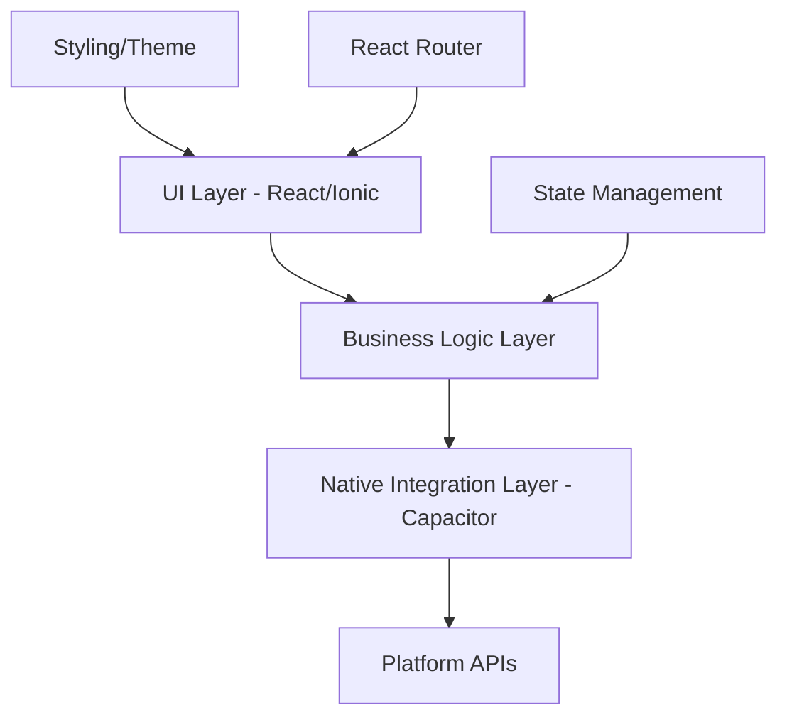
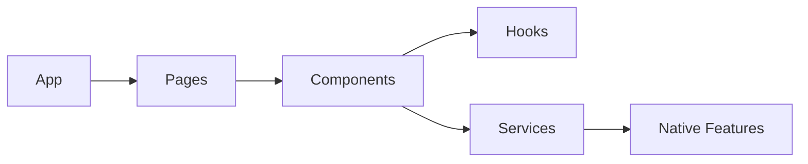

# System Patterns

## Architecture Overview



## Design Patterns

### Component Architecture

1. Presentational Components

   - Pure UI components
   - Receive props, render UI
   - No direct state management
   - Reusable across features

2. Container Components
   - Handle business logic
   - Manage state
   - Coordinate with native features
   - Feature-specific implementation

### State Management

- Local component state for UI
- React Context for shared state
- Props for component communication
- Native state handled by Capacitor

### Navigation Pattern

- React Router for web navigation
- Ionic page transitions
- Deep linking support
- Platform-specific navigation patterns

## Technical Decisions

### Framework Choices

1. React + TypeScript

   - Type safety
   - Component reusability
   - Large ecosystem
   - Developer productivity

2. Ionic Framework

   - Mobile-first components
   - Platform adaptability
   - Performance optimization
   - Built-in theming

3. Capacitor
   - Native feature access
   - Cross-platform support
   - Modern API design
   - Active community

### Development Patterns

1. Code Organization

   ```
   src/
   ├── components/    # Reusable UI components
   ├── pages/        # Route-level components
   ├── hooks/        # Custom React hooks
   ├── services/     # Business logic
   ├── utils/        # Helper functions
   └── types/        # TypeScript definitions
   ```

2. Testing Strategy

   - Unit tests for components
   - Integration tests for features
   - E2E tests for critical paths
   - Platform-specific testing

3. Error Handling
   - TypeScript for compile-time checks
   - Try-catch for async operations
   - Error boundaries for React components
   - Native error handling for platform features

## Component Relationships



## Build and Deployment

1. Development

   - Vite dev server
   - Hot module replacement
   - Source maps
   - TypeScript checking

2. Production
   - Code splitting
   - Asset optimization
   - Platform-specific builds
   - Version management
